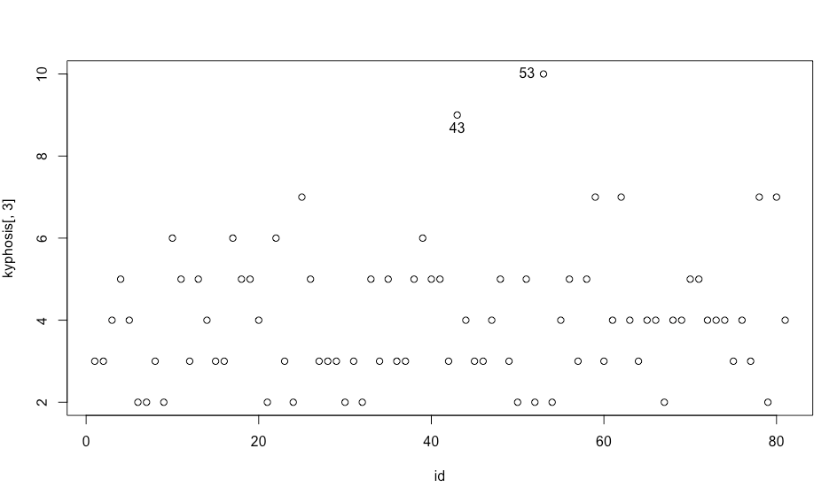
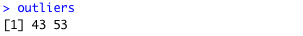

```{r setup, include=FALSE}
knitr::opts_chunk$set(echo = TRUE)
```

## Load Dataset

The dataset consists of 81 rows and 4 columns. It characterize patients and whether they suffer kyphosis and a response factor with levels absent, present. Variable Age represents the age in months and variables Number and Start are related to operation details. 

```{r kyphosis}
data("kyphosis",package="rpart")
nrow(kyphosis)
ncol(kyphosis)
summary(kyphosis)
```

## Outliers Detection

The column Number shows the number of vertebra involved in the operation. We would like to analyze this feature. Particularly, we are interested about the five-number summary, box-plot, that will help us to spot any outliers. A box-plot displays the Minimum, 1st Quartile, Median, 3rd Quartile and Maximum of the distribution of the data. We can construct a box-plot by following the following 4 steps:

1. Order variable in asceding order(small to large)
2. Find the median
3. Find Quartiles
4. Find min and max

The 1st quartile is the median of data points to the left of median, while the 3rd quartile is the median of data points to the right of median. In R, we use the boxplot command to calculate and display the five-number summary statistics. The index [3] in command below tells to use the third feature of the dataset which is the variable Number.


```{r}
boxplot(kyphosis[3],data=kyphosis, xlab="Variable Number")
```

Visually we can inspect the plot and see that there are 2 outlier data points with values in the range [8-10]. There are 2 ways which can help to identify in which rows in the dataset the outliers correspond to. First, we will write a helper function which returns a boolean to indicate whether a point is outlier and then we will use the build-in function identify.

```{r}
is_outlier <- function(data) {
   lowerq = quantile(data, na.rm = TRUE)[2]
   upperq = quantile(data, na.rm = TRUE)[4]
   iqr = upperq - lowerq 
   threshold_upper = (iqr * 1.5) + upperq
   threshold_lower = lowerq - (iqr * 1.5)
   data > threshold_upper | data <  threshold_lower 
}
```

We use the following driver code to find the rows which correspond to outliers data points of variable Number.
```{r}
kyphosis[rowSums(sapply(kyphosis[3], is_outlier), na.rm = TRUE) > 0, ]
```
The rows we are interested in are 43 and 53.

Alternatively, we can use the function *Identify* to perform the same analysis as before. Identify allows us to visually select values from any plot and returns the indices of selected points. For this manner we plot the variable *number* and then invoke *identify* function.


```{r}
#id <- c(1:length(kyphosis[,3]))
#plot(id, kyphosis[,3])
#outliers <- identify(id, kyphosis[,3])
```

We have commented out the above code since we can not use properly the identify function within a markdown. Instead we append the screenshots below.




The result is the same as with *is_outlier* function. Outliers correspond to rows 43 and 53 in the dataset.


## References

RStudio Documentation [@https://docs.rstudio.com/].

Box-plot [@https://en.wikipedia.org/wiki/Box_plot].

Five Number Summary [@https://en.wikipedia.org/wiki/Five-number_summary].
